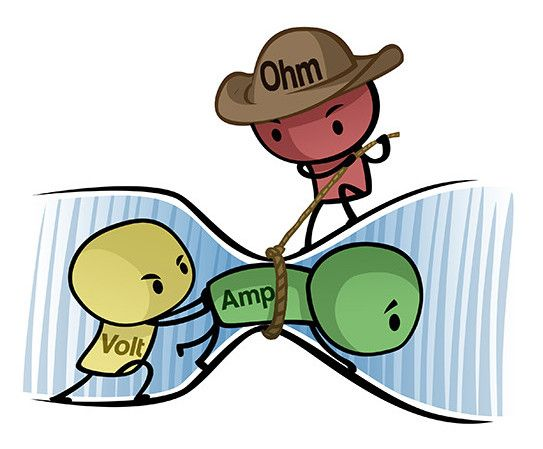
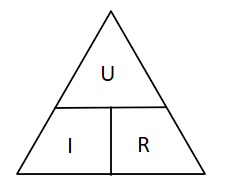
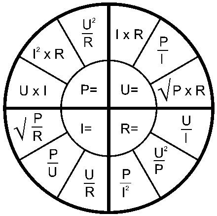
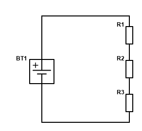
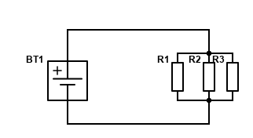
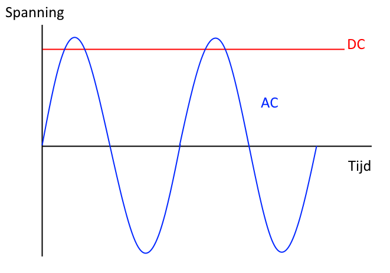

# Basisprincipes
## Spanning, stroomsterkte en weerstand

**Spanning** is het verschil in potenti&euml;le elektrische energie tussen twee punten per eenheid van lading. Een elektrische voedingsbron kan een bepaalde spanning hebben en we drukken die spanning uit met de eenheid **Volt** met afkorting **V**. Spanning wordt afgekort met **U**, dit komt van het latijn urgere. Spanning wordt gemeten **over** een component (parallel).  

**Stroom** is de transport van een elektrische lading door de beweging van elektronen door geleiders. In een kring met een elektrische voedingsbron en een verbruiker vloeit een stroom. De sterkte van die stroom wordt uitgedrukt met de aanheid **Amp&egrave;re** met afkorting **A**. Stroom wordt afgekort met **I**, dit komt van intensiteit. Stromen zijn vaak zo klein dat men het SI-voorvoegsel mili (m) gebruikt 0,001 A is dus 1 mA. Stroom wordt gemeten **in* een kring (serie).  

Een elektrische **weerstand** is de eigenschap van materialen om de doorgang voor elektrische stroom te belemmeren. Dit wordt uitgedrukt met de eenheid **Ohm** met afkorting **&ohm;**. Weerstand wordt afgekort met **R**, dit komt van resistance. Weerstanden zijn vaak zo groot dan met de SI-voorvoegsels kilo (k) en mega (m) gebruikt vaak wordt het symbool &ohm; dan zelfs niet meer vermeld. Een weerstand van 1k is dus 1000 &ohm; en een weerstand van 1m is 1 000 000 &ohm;. De weerstand wordt gemeten **uit** de kring, over een component.  

## Wet van Ohm
De wet van Ohm zegt: `de stroomsterkte door een geleider is recht evenredig met het potentiaalverschil tussen de uiteinden`.

Hieruit kunnen we enkele formules besluiten:  
> U = I x R  
> I = U / R  
> R = U / I

## Vermogen
Het **vermogen** is de energie die gedurende een bepaalde tijdseenheid door een elektrisch systeem geleverd wordt. Het vermogen wordt uitgedrukt met de eenheid **Watt** met afkorting **W**. Vermogen wordt afgekort met **P**, dit komt van power. Het vermogen wordt meestal aangegeven op apparaten maar kan ook berekend worden.  

Het vermogen dat een verbruiker in een gesloten circuit vraagt is afhankelijk van zijn weerstand. Door een lamp van 60 Watt stroom dan ook meer stroom dan door een lamp van 25 Watt..  

> P = U x I  
> U = P / I  
> I = P / U  

## Lading
De elektrische **lading** is een elektrische eigenschap van elektronen. De lading wordt uitgedrukt met de eenheid **Coulomb** met afkorting **C**. Lading wordt afgekort met **Q** van quantity.

> Q = I x t  
> I = Q / t  
> t = Q / I  

## Serie en parallel

## Serie

In serieschakelingen zijn de componenten achter mekaar geschakeld. De stroom vloeit van de eerste component naar de laatste component. Als een component defect is kan er helemaal geen stroom meer vloeien en werkt de kring niet meer.  
  

## Parallel

In een parallelschakeling zijn de componenten naast mekaar geschakeld. De stroom vloeit door alle componenten tegelijkertijd. Als een component defect is werken de andere componenten nog altijd.
  
## Wet van Kirchhoff
### Stroomwet

Doordat elektrische kringen hun lading behouden, is de hoeveelheid lading dat de kring in gaat, gelijk aan de hoeveelheid lading dat de kring uit gaat. Hetzelfde geldt voor stroom, omdat dit de hoeveelheid lading per tijdseenheid is.  

`In elk knooppunt van een elektrisch netwerk is de som van de stromen die in dat punt samenkomen gelijk aan de som van de stromen die vanuit dat punt vertrekken.`  

  
De stroom verdeelt zich in parallelle kringen. De stroom naar het knooppunt is positief, de stroom vanuit het knooppunt is negatief. De som van alle stromen naar een knoppunt in een kring is hierdoor altijd 0.  

### Spanningswet

Doordat elektrische kringen hun energie behouden, is de hoeveelheid energie dat de kring in gaat gelijk aan de hoeveelheid energie dat de kring uit gaat. Hetzelfde geldt voor spanning.     

`De som van de elektrische potentiaalverschillen (spanning), rekening houdend met de richting, in elke gesloten kring in een netwerk is gelijk aan nul.`

  
De spanning verdeelt zich in serie kringen. De som van de spanningen over elke component in de kring, gemeten in de richting van de klok, is altijd 0.

## AC en DC
**Direct current** (DC) of gelijkstroom en **alternating current** (AC) of wisselstroom zijn manieren om spanning door te geven. Bij DC lopen de elektronen altijd in dezelfdez richting, van plus naar min (eigenlijk anderom). De Wet van Ohm hier hierop toepasbaar en het vermogen is eenvoudig te bepalen. DC wordt vaak gebruikt in digitale kringen om een hoog signaal (aan) of een laag signaal (uit) te bepalen. Bij wisselstroom wisselt de richting van de elektronen in een geleider continu. Je hebt voor AC dus geen plus en min meer. AC is gekozen omdat DC niet over lange afstanden te transporteren was zonder enorme verliezen. Een hoge AC spanning kan ook grotere afstanden aan dan een lage AC spanning.

